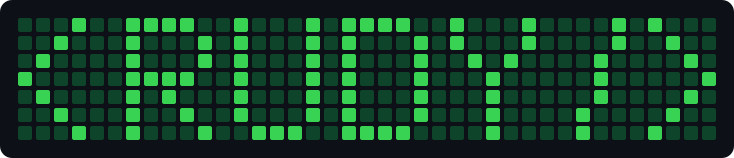

# `<RUDY/>`

Intentional pixel art for [@Radishoux's contribution calendar](https://github.com/Radishoux).



The backdated commits are decorative art, created in October 2026. They do **not**
represent historical software-development activity.

- **1 art commit** per background day, 8 October 2025–6 October 2026.
- **50 art commits total** on each of the 82 painted days, including the background.
- **4,382 art commits** across 364 days. Other contributions can add to these counts.

The `<RUDY/>` design spans 39 weeks, 4 January–3 October 2026. GitHub controls
its exact green thresholds; the preview shows the intended contrast.

```sh
bun run preview
bun test
bun run status
```

Open `art/preview.html` for the full calendar and light/dark views. Previewing
writes these artifacts but never commits or pushes. The rolling calendar
progressively crops the artwork after January 2027; the 2026 year view retains
all lettering.

`codex/rudy-contribution-art` is the default branch. `master` preserves the
previous script and all original history. No branches were deleted or force-pushed.

The generator counts artwork already present and adds only missing commits.
After committing any source changes, the explicit maintenance commands are:

```sh
bun run generate
bun run verify
bun run publish
```

Generation is local only. Publication is a separate command that sends at most
500 pending commits per push, and can resume after a failed push. A completed
artwork is not duplicated by running generation again.

See [architecture and recovery instructions](docs/ARCHITECTURE.md).

Inspiration: [Gitgenix](https://gitgenix.netlify.app/draw),
[github_painter](https://github.com/mattrltrent/github_painter), and
[GitHub Contribution Art](https://github.com/amantinband/github-contribution-art).
